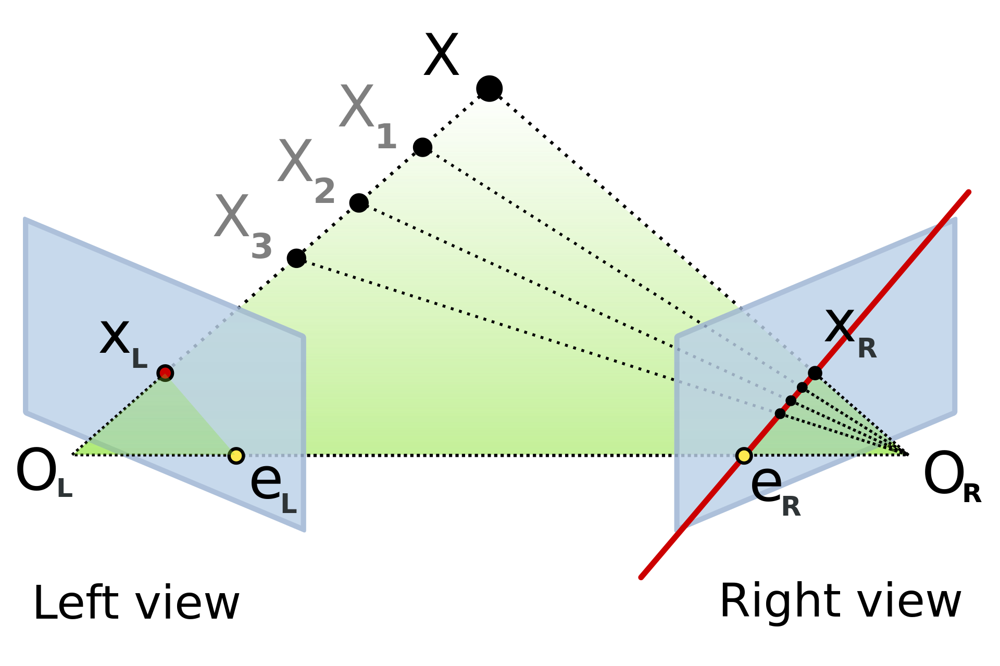

[[A Word on Change of Basis.]]
[[Jacobi's method]]

### Cross products
$[a]_\times$ - notation of a cross product

### Constructing epipolar line
- [x] It says that the epipolar line is constructed by the following: $l'=e' \times x'$ , now why do you do this via a cross-product?

### Algebraic derivation
- $X(\lambda) = P^{+} \rm{x} + \lambda C$. $C$ is nullspace of $P^{+}$, $P^{+}$ is a **pseudo-inverse** of $P$.
	- [x] Why do you need to add a nullspace here? 
		- To consider to projection of an infinitely far point into zero. 
	- [x] What is pseudo-inverse matrix? A more general definiton of inverse. (See "Moore-Penrose inverse")
	- [x] Why $\lambda$ is chosen $0$ and $\infty$ ?
	- [ ] How do you compute pseudo-inverse?
---

### Computing

- Ok well, so I know the $O_L$ in advance: it's in the zero of coordinates. 
- I don't know $e_R$ since it's defined by $O_R$ which I don't know. So, I can guess that fundamental matrix computation is actually a minimization problem. 